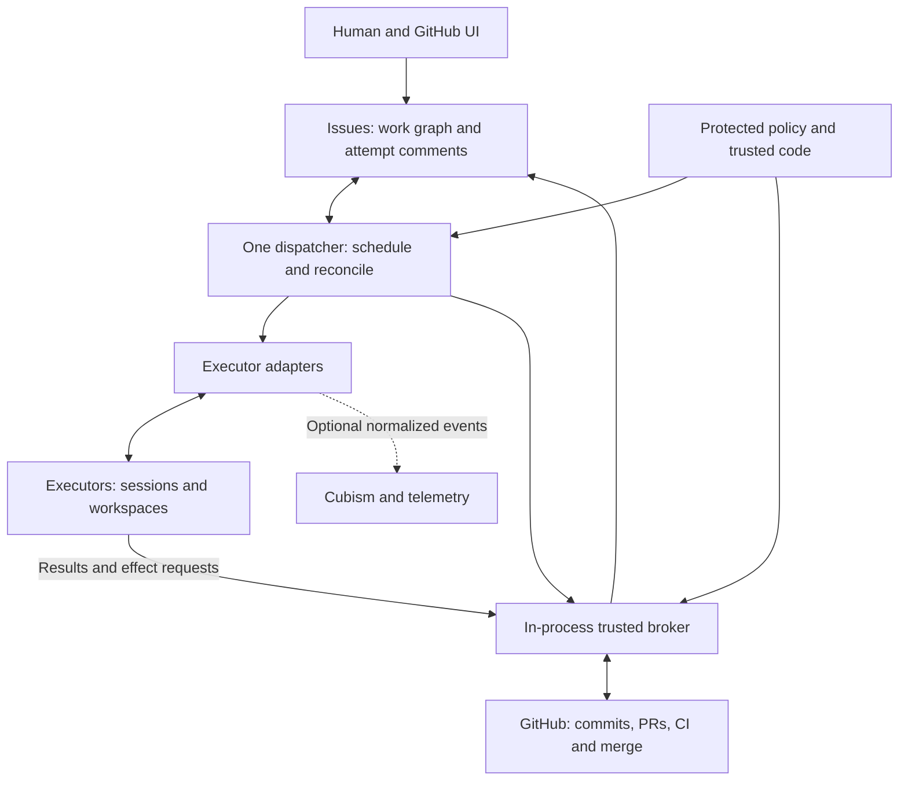

# Nightshift — Architecture and work model

[Overview](index.html) · [Document index](README.md) · [Previous](01-product-and-prototype.md) · [Next](03-durable-state-machines.md)

> Revised design proposal · 2026-09-13 · GitHub-native, single-dispatcher profile. No Nightshift implementation is included.

## 5. Recommended architecture

Use a small Python CLI/process, building on the repository's existing tooling. Modules within that process perform GitHub reads, scheduling, reconciliation, policy validation, executor adaptation and trusted effects. No independently deployed Nightshift service is needed.



The executor is a separate restricted process/workspace. The broker is in the trusted dispatcher's process, not the agent's process. Arrows from executors convey requests, never reusable GitHub credentials. Telemetry export has bounded buffering and no awaited acknowledgement in scheduling or effects.

### Sources of truth

| Fact | Authoritative record | Reconstructible view |
|---|---|---|
| Milestone, epic, slice and dependencies | GitHub Issues, native parent/sub-issue and blocking edges | Readiness list and graph snapshot |
| Scope and acceptance criteria | Issue contract and broker-recorded revision/digest | Attempt's pinned contract summary |
| Attempt allocation, outcome and effect intent | Broker-authored structured issue comments | In-memory attempt index |
| Session contents and continuation | Executor-native store | Opaque session reference in comment |
| Candidate | Repository identity plus full commit SHA and retained branch | Selected-candidate reference in comment/PR |
| Verification | Trusted workflow run, Check or status for exact subject | Durable summary in attempt comment |
| Merge | GitHub PR merge state and resulting Git objects | Issue completion and milestone report |
| Policy | Protected/default-branch version or explicit trusted source | Pinned policy SHA/digest per attempt |
| Human decision | Authorized human's GitHub comment identifying exact checkpoint | Gate labels |
| Cost/outcome analytics | Normalized observed usage with provenance | Cubism aggregates; never work authority |

Labels display ready/blocked/running/review/gate states but are not locks or sufficient acceptance evidence. On disagreement, reread authoritative objects; do not blindly replay labels. GitHub is not a consistent multi-object snapshot. Revalidate prerequisites immediately before dispatch and protected effects; changed or unavailable inputs block progression.

### Deployment profiles

| Profile | One authoritative work graph | Execution records and concurrency | Adoption trigger |
|---|---|---|---|
| GitHub-native — initial | GitHub Issues | Attempt comments; one dispatcher; serial attempts initially | Current Cubism development |
| Beads — optional later | Beads with embedded Dolt, no server | Separate compact attempt journal adapter, not Beads work objects; one dispatcher | Offline/local work, richer graph semantics, Dolt history or GitHub independence |
| Concurrent Beads — later | Beads with Dolt server | Multiple graph writers; still one Nightshift dispatcher until separately qualified | Real concurrent users/processes writing the graph |
| Distributed control plane — deferred | Explicitly selected GitHub or Beads backend; PostgreSQL may own the graph only after an explicit migration | PostgreSQL may own runtime coordination, cross-host fencing, strict budget accounting and durable outbox | Multiple active dispatchers or demonstrated safety requirements |

In Beads profiles, Beads owns milestones, slices, readiness, claims, discovered work, completion and replanning. GitHub mirrors, if offered, are read-only projections for topology; PR/commit facts remain native. The non-GitHub attempt-journal format is deliberately a future adapter requirement, not a reason to add a local journal today. Concurrent graph writes do not by themselves establish safe concurrent dispatchers or effect brokers.

A backend migration pauses dispatch, settles effects, imports and checks topology and stable ID mappings, names the new authority in trusted configuration, then resumes. No bidirectional authoritative synchronization, dual writes or automatic graph conflict merging. Dolt history can explain a milestone's replanning; never create a Dolt branch per attempt.

## 6. Work model and GitHub capabilities

A milestone is a parent issue with acceptance criteria and a checkpoint discussion. Optional epic parent issues group slices below it. A GitHub Milestone may group issues for UI convenience, but is not a second acceptance authority. A slice has one parent; native blocking edges describe prerequisites separately from hierarchy. A milestone integration slice is a real work item with the outcome “verify the assembled milestone,” not a dummy issue per integration attempt.

| Concept | Contract |
|---|---|
| Milestone | Intended integrated outcome, included slices, non-goals, acceptance and approver |
| Slice | Independently testable bounded outcome, validation commands, context and dependencies |
| Attempt | One role assignment with fixed source/contract/policy inputs; zero or more native session references |
| Session | Executor-owned conversation/execution context; may be resumed within an attempt |
| Candidate | Exact repository/head/base identity produced by an implementation or repair attempt |
| Review round | Required review attempts for one candidate/input set; derived grouping, not a work item |
| Effect | Broker-authorized exact mutation with stable key, payload digest and observed result |

One session may serve successive attempts through explicit continuation, but those assignments never overlap and usage is attributed by delta. A fork, role change, different candidate or replacement execution creates a new attempt ID linked to its predecessor. Resuming the same still-authorized assignment can keep its ID. Attempt counters are display values; IDs establish identity.

### Current API and CLI support, checked 2026-09-13

GitHub has native [sub-issue REST endpoints](https://docs.github.com/en/rest/issues/sub-issues) and [blocking dependency endpoints](https://docs.github.com/en/rest/issues/issue-dependencies). Relationship writes require Issues write access. API bodies use the issue's database `id`, not its repository-local issue number.

| Operation | REST route relative to `/repos/{owner}/{repo}` |
|---|---|
| List/add children | `GET/POST /issues/{number}/sub_issues` |
| Read parent | `GET /issues/{number}/parent` |
| Remove child | `DELETE /issues/{number}/sub_issue` with `sub_issue_id` |
| List/add blockers | `GET/POST /issues/{number}/dependencies/blocked_by` |
| List dependents | `GET /issues/{number}/dependencies/blocking` |
| Remove blocker | `DELETE /issues/{number}/dependencies/blocked_by/{issue_id}` |

The current [gh issue edit manual](https://cli.github.com/manual/gh_issue_edit) exposes `--parent`, `--add-sub-issue`, `--add-blocked-by`, `--add-blocking` and corresponding remove flags. Use these or `gh api`; do not assume an extension is necessary. The inspection environment had no `gh` binary, so flags were verified against the current manual rather than executed. Installation qualification must probe local CLI/host capabilities; older CLI can use REST, while a host lacking native relationships is unsupported by this initial profile rather than silently replaced with parsed checklists.

Illustrative broker operations, not commands executed in this revision:

```bash
gh issue edit 123 --repo OWNER/REPO --parent 100
gh issue edit 123 --repo OWNER/REPO --add-blocked-by 122
gh api --paginate repos/OWNER/REPO/issues/123/dependencies/blocked_by
```

Paginate graph, comments and PR reads completely for the selected milestone; missing pages or inaccessible blockers mean unknown readiness. Detect cycles, orphan slices and inconsistent parentage. Native blocking edges alone do not prove a closed prerequisite succeeded: its contract declares the predicate (normally merged-and-verified), and cancelled/superseded work cannot satisfy it without authorized replanning. Labels and assignment provide human visibility, not mutual exclusion.

### Scope and replanning

Retain the current Outcome, Scope, Acceptance criteria, Validation, Demo, Non-goals and Context fields. Add native dependencies, milestone association, limits and contract revision. At dispatch record the exact contract digest and material criteria in the allocation comment; a bare digest cannot reconstruct an edited issue body.

Retries, review requests, context exhaustion and provider failover produce attempts on the same slice. Create/split/replace slices only for changed intended work, such as a newly discovered prerequisite or a broader acceptance requirement. Record a compact replanning comment on the parent with stable plan-change ID, reason, old/new nodes and edges, authority and changed criteria. Pause affected work during its multi-call mutation; restart completes or flags a partially applied change before scheduling it. The current graph is authoritative; comments explain its evolution without claiming immutable database history.

Within approved scope, bounded replanning can proceed automatically. Scope expansion or weaker criteria require the designated human. Display plan revisions and denominator changes so splitting work does not manufacture progress.

---

[Overview](index.html) · [Document index](README.md) · [Previous](01-product-and-prototype.md) · [Next](03-durable-state-machines.md)
