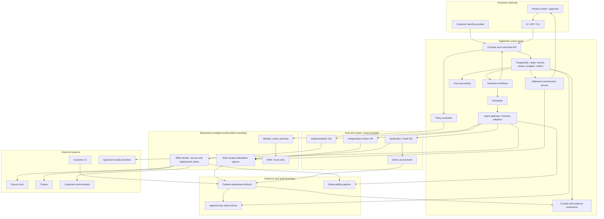

# Nightshift — Architecture and work model

[Overview](index.html) · [Document index](README.md) · [Previous](01-product-and-prototype.md) · [Next](03-durable-state-machines.md)
> Design proposal · Packaged 2026-09-09 · Original sections 5–6 preserved below. Repository findings refer to the inspected checkpoint, not live project state.

## 5. Recommended reference architecture

Use a modular control-plane application with a small number of separately privileged services. Avoid premature microservice decomposition, while separating credentials and execution trust boundaries from the beginning.

Concrete hosted defaults:

- **Python control-plane services**, preserving the prototype’s language and enabling incremental extraction.
- **PostgreSQL** for authoritative contracts, aggregate state, leases, operation records, budgets, inbox/outbox, and evidence indexes.
- **Temporal Cloud** for durable orchestration and timers; self-hosted Temporal for deployments whose residency requirements exclude the managed service.
- **OPA** for authorization and policy evaluation, behind a constrained customer policy schema.
- **S3-compatible object storage** for content-addressed artifacts; AWS S3 and KMS for the initial hosted deployment.
- **React/TypeScript UI**, REST/OpenAPI, event streaming, and a thin CLI.
- **Managed containers for trusted control services**; ephemeral VMs for untrusted execution.
- **GitHub first**, with repository, tracker, CI, and deployment adapters kept separate.
- **OpenTelemetry** for operational telemetry; separate immutable audit evidence.
- Existing customer CI remains supported. Nightshift supplies a verification runner when the existing CI cannot meet the contract.

Temporal should coordinate work, not become a second source of business truth. Each activity invokes an idempotent domain command against PostgreSQL. Workflow history records orchestration; committed domain events establish authority. Temporal’s own architecture requires deterministic workflow code and idempotent or non-retryable activities. [Temporal architecture](https://github.com/temporalio/temporal/blob/main/docs/architecture/README.md)

### Component and trust-boundary diagram



Arrows from runners to privileged services represent authenticated requests, not possession of source-host or deployment credentials.

### Deployment modes

| Mode | Control plane | Execution and code | Assurance boundary |
|---|---|---|---|
| Hosted SaaS | Nightshift-operated | Nightshift ephemeral runners | Nightshift operates the full execution trust boundary |
| Hybrid | Nightshift-operated | Customer runners and optional customer artifact store | Customer controls runner integrity; residency rules govern metadata and model traffic |
| Customer VPC | Dedicated managed deployment | Customer VPC | Same software, tenant-specific infrastructure and keys |
| Self-hosted enterprise | Customer-operated | Customer-operated | Customer owns operations and trust roots; support contract defines responsibilities |

A customer runner connects outbound using mutual authentication. Jobs carry signed manifests and short-lived capabilities. A network partition permits bounded local computation until its execution allowance expires; it does not permit offline merges or new privileged effects.

## 6. Domain model and work planning

The hierarchy is:

```text
Tenant
└── Portfolio
    └── Program
        ├── Epics
        ├── Versioned plan DAG
        ├── Milestone contracts spanning selected epics
        ├── Slices belonging to an epic
        │   ├── Implementation attempts
        │   └── Review rounds and review attempts
        ├── Feedback items linked to decisions and corrective slices
        ├── Releases containing repository/artifact vectors
        └── Incidents affecting any of the above
```

| Entity | Meaning |
|---|---|
| Portfolio | Business priorities and resource allocation across programs |
| Program | Outcome spanning time, repositories, and milestones |
| Epic | Coherent capability area; never directly executable |
| Milestone contract | Versioned acceptance boundary with scope, evidence, authority, and permitted next actions |
| Slice | One independently testable vertical outcome, normally implemented within one bounded session |
| Attempt | One execution identity and budget allocation; may checkpoint across sessions |
| Review round | Evaluation of one immutable candidate under one review policy |
| Feedback item | Original human observation plus its agreed interpretation and resolution links |
| Release | Immutable vector of source revisions, artifacts, configuration, and environment intent |
| Incident | Safety, correctness, availability, access, or evidence failure requiring containment and recovery |

A broad outcome becomes work through:

1. Capture user journeys and acceptance criteria.
2. Map existing capabilities and constraints from evidence.
3. Identify uncertainties and architectural decisions.
4. Create bounded discovery slices where uncertainty prevents implementation.
5. Propose vertical slices, dependency edges, and milestone demonstrations.
6. Validate the DAG for cycles, missing prerequisites, scope coverage, and risk.
7. Activate the plan within the human-approved execution envelope.

Readiness requires satisfied dependency predicates, an immutable contract revision, defined validation, a compatible runner, sufficient reserved budget, and an open gate. Dependency predicates distinguish “source merged,” “artifact published,” and “behavior deployed.”

Prioritization combines critical-path impact, business priority, feedback urgency, aging, expected duration, and available capabilities. Issue number is only a stable tie-breaker.

Risk is the maximum of declared risk, deterministic path/change rules, environment impact, and detected concerns. Agents may raise risk. Lowering it requires the policy-defined authority.

Material architectural decisions become versioned ADR proposals. An architecture agent may approve decisions within predelegated boundaries; changes to customer commitments, trust boundaries, or risk acceptance require the designated human authority.

Replanning preserves the previous DAG and records why nodes were split, replaced, deferred, or cancelled. Completion percentages use a named plan revision and display denominator changes.

### Illustrative slice contract

All digests below are abbreviated examples.

```yaml
schema: factory.slice/v1
id: slice-104
tenant: acme
program: delivery-pilot
epic: recovery
revision: 3
outcome: An expired worker cannot publish a candidate
scope:
  repositories: [acme/service]
  paths: [factory/leases/**, tests/leases/**]
non_goals:
  - Multi-region failover
acceptance:
  - id: AC1
    behavior: Generation 7 publication is rejected after generation 8 is issued
    verification: stale_worker_publish_test
dependencies:
  - slice: slice-103
    predicate: merged
validation:
  commands:
    - ["pytest", "tests/leases/test_stale_publish.py"]
risk: high
policy_digest: sha256:policy7
context:
  - uri: evidence://adr-lease-protocol
    digest: sha256:adr4
budget:
  wall_minutes: 90
  max_usd: 30
  max_attempts: 3
milestone_contract: recovery-demo@2
```

Paths guide scope enforcement but do not prove semantic scope. A diff touching an allowed file can still exceed the contract; independent acceptance review addresses that remaining judgment.

---

[Overview](index.html) · [Document index](README.md) · [Previous](01-product-and-prototype.md) · [Next](03-durable-state-machines.md)
