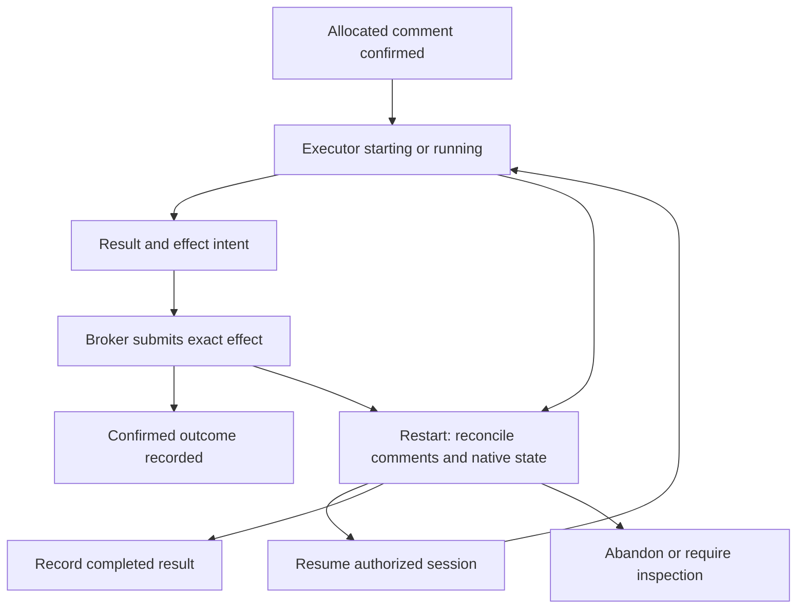

# Nightshift — Attempt journal and state machines

[Overview](index.html) · [Document index](README.md) · [Previous](02-architecture-and-work-model.md) · [Next](04-execution-scheduling-review.md)

> Revised design proposal · 2026-09-13 · GitHub-native, single-dispatcher profile. No Nightshift implementation is included.

## 7. GitHub-native durability and transitions

Issue comments are a modest durability mechanism for a small number of attempts, not a high-throughput event store. No database transaction, unique constraint, compare-and-swap across comments, or immutable history is implied. Human edits/deletions, lost responses, pagination and rate limits are part of the failure model. The broker is the sole writer of machine records; only trusted broker-authored records with valid schema and matching assignments are accepted. A marker copied into an arbitrary user's comment carries no authority.

### Compact attempt schema

Use one primary comment per attempt on its slice. Integration attempts use the relevant implementation slice for pre-merge verification or the milestone integration slice for assembled verification. This illustrative record uses abbreviated SHAs; production records use full IDs.

````markdown
<!-- nightshift-attempt:01994ba0-6a00-7000-8000-000000000123 -->
### Implementation attempt 3
```yaml
schema: nightshift.attempt/v1
attempt_id: 01994ba0-6a00-7000-8000-000000000123
revision: 2
slice: github:OWNER/REPO#123
role: implementation
predecessor_attempt: null
executor: factory-droid
model: claude-sonnet
session_ref: {adapter: factory-droid, opaque_id: droid-session-123}
status: completed
allocated_at: 2026-09-13T19:23:59Z
started_at: 2026-09-13T19:24:00Z
finished_at: 2026-09-13T19:41:00Z
contract: {revision: 1, digest: 'sha256:contract', summary: 'Implement the specified sparse aggregation behavior'}
policy: {source_commit: abc123, digest: 'sha256:policy'}
base_commit: abc123
candidate_commit: def456
outcome: candidate-produced
failure_class: null
usage: {tokens: 184291, cost: 2.84, currency: USD, basis: executor-reported}
review: pending
workflow_checks: []
artifact_refs: []
effects: []
```
````

A globally unique UUID (for example UUIDv7) or ULID is allocated before any executor launch. The marker and field must agree. Required allocation fields include ID, role, slice, input identities, executor/model selection, limits, allocation time, status and schema. Session, candidate, timestamps and usage can be unknown; null is distinct from zero. Record supported model version and adapter/runtime version when available. Keep secrets and transcripts out. A separate `adapter_metadata` object may hold provider-specific details, never domain control state.

`revision` detects unexpected changes in this single writer's own record; it is not atomic concurrency control. Treat terminal outcomes as final in normal operation. Later usage corrections or recovered facts carry a correction reason/time and preserve the previous value, or use a linked correction comment. Duplicate identical markers are reconciled to a canonical comment ID with duplicates referenced; contradictory payloads block the attempt. Unknown schema, missing trusted records or unexplained edits require inspection.

### Durable launch and completion order

1. Reconcile the slice, validate readiness/policy and compute conservative remaining limits in memory.
2. Allocate ID; write and confirm an `allocated` comment before launching. If POST times out, paginate comments and find the marker; never blindly allocate another ID or launch while its durable allocation is uncertain.
3. Record `starting`, stable launch key and intended workspace; launch via adapter using the attempt ID as a correlation/idempotency key where supported. This key does not invent executor-side deduplication.
4. Record `running` and native session reference as soon as observed. Stream detailed events transiently; write only material lifecycle changes, permission waits and summaries to GitHub.
5. Validate the returned subject/result; broker publishes permitted candidate objects and records their IDs. Write terminal outcome and observed usage. Executor exit zero alone is not proof of acceptance.
6. A failed durable write stops dependent scheduling and protected progression until reconciled. In-flight bounded computation can finish without new effect authority.

The launch-to-session-recording gap cannot be eliminated. Restart may find a running executor without a recorded session reference, or a result published without the terminal comment. Recovery can abandon work or occasionally duplicate computation. It cannot blindly repeat a protected effect.

### Slice state machine

States are interpreted from issue contract/topology, attempt summaries and native GitHub facts. They are not rows in an event-sourced aggregate framework. The broker updates UI labels after confirming facts; partial label writes are repaired on reread.

| Transition | Preconditions / result | Failure behavior |
|---|---|---|
| proposed → ready | Valid bounded contract, satisfied native dependencies, open gate, qualified adapter and limits | Keep proposed/blocked on missing information |
| ready → active | Allocation comment confirmed; current in-process assignment | Reconcile ambiguous allocation before launch |
| active → reviewing | Candidate identified and prerequisite checks valid | Failure creates retry/repair attempt or blocks |
| reviewing → rework | Structured blocking findings | Preserve findings and create bounded repair attempt |
| rework → active | Same intended scope, limits and gate permit | Changed scope enters replanning |
| reviewing → integrating | Required current reviews pass; no unresolved findings | Missing/stale result remains nonpassing |
| integrating → complete | Verification-only slice: exact assembled-source checks/demo satisfy its contract, required review policy is met, no pending effects; no source change or PR required | Missing/stale evidence blocks; a source change follows the reviewed candidate/merge path |
| integrating → merged | Exact-head merge confirmed by GitHub after required integration verification | Unknown effect blocks; moved inputs need fresh verification |
| merged → complete | Slice's explicit completion predicates hold | Remain merged if further verification is required |
| any unfinished → blocked | Dependency, pause, limit, access, uncertainty or safety failure | Revoke new effects and settle admitted effects |
| blocked → ready/reviewing/integrating | Reconciliation and fresh predicates justify the particular next step | Do not restart implementation if a valid candidate already exists |
| unmerged → cancelled/superseded | Authorized decision, admitted effects settled | Preserve attempts and replacement links |

A merged fact cannot be cancelled retroactively; a revert is new work. A closed issue is insufficient evidence of complete work. Cancelled/superseded issues have explicit outcomes and do not unblock dependents as successful slices.

### Attempt state machine

| Transition | Rule |
|---|---|
| absent → allocated → starting → running | Each pre-launch durable write confirmed; native session reference recorded when available |
| running → waiting_permission → running | Adapter surfaces request; trusted permission decision recorded; no self-approval |
| running → suspended | Executor confirms native checkpoint/stop; pending effects settled |
| suspended → starting | Same fixed inputs and authorized assignment; native resume supported; fresh process-local capability |
| running → completed | Normalized result and summary durably recorded; role-specific evidence evaluated separately |
| allocated/starting/running/waiting_permission/suspended → failed/cancelled/abandoned | Reason and known/unknown usage retained; revoke authority before replacement |
| any nonterminal → needs_inspection | Contradictory/missing evidence or ambiguous external action |
| needs_inspection → supported recovered state or abandoned | Recorded reconciliation decision, never an invented success |

Terminal attempts are not reopened as retries. A replacement gets a new ID and predecessor link. Review `completed` with `verdict: changes_required` is a completed review execution, not a passing slice.

### Review and effect state

Review outcomes are `pass`, `changes_required`, `inconclusive`; disputes are recorded per finding and resolved by a separately assigned reviewer or authorized human. A changed subject starts a new review round. Relevant prior blocking findings carry forward until resolved with evidence, explicitly invalidated, or waived by the policy's authority. A later pass cannot mask a fail.

Protected effects use `prepared → submitted → confirmed`, or `submitted → uncertain → confirmed/not_applied/needs_inspection`. Record effect key, action, bounded normalized arguments (or an immutable input reference), payload digest, expected subject, target, authorizing attempt and returned object identifiers inside the attempt comment before submission. A key reused with different input is rejected. Each pending effect is reconstructed and reconciled before conflicting replacement work.



Milestone states and decision semantics are in [section 13](06-milestones-and-product-experience.md); the restart algorithm and effect-specific guarantees are in [section 15](07-reliability-security-economics.md). These describe ordered calls and reconciliation, not PostgreSQL-level transactions.

---

[Overview](index.html) · [Document index](README.md) · [Previous](02-architecture-and-work-model.md) · [Next](04-execution-scheduling-review.md)
