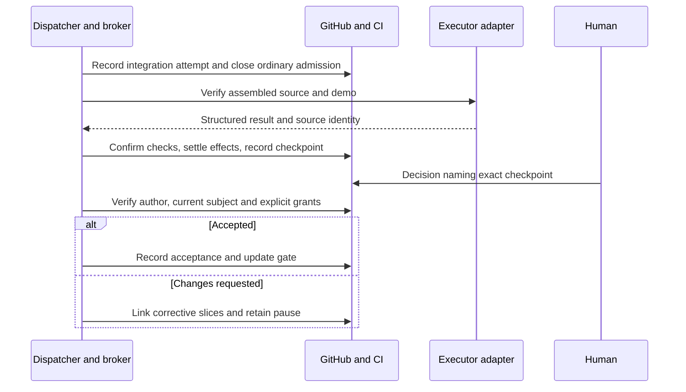

# Nightshift — Milestones and product experience

[Overview](index.html) · [Document index](README.md) · [Previous](05-trust-policy-evidence.md) · [Next](07-reliability-security-economics.md)

> Revised design proposal · 2026-09-13 · GitHub-native, single-dispatcher profile. No Nightshift implementation is included.

## 13. Milestone contract and acceptance

A milestone is more than a count of closed slices. Its parent issue defines observable integrated outcomes, included/excluded work, criteria and validation, a named human approver, finite limits, and any authority granted by acceptance. Initial default: merge and demonstrate Cubism changes, then human acceptance; no production deployment authority.

Use a genuine integration slice when assembled behavior needs explicit work: it depends on the implementation slices and can have multiple integration/repair/review attempts. It is created once for that intended outcome, not per check run. If integration exposes a defect within the still-open integration slice's repair scope, use another attempt there. For a defect in an already completed slice, create a linked corrective slice describing the newly discovered work; preserve the original merge/completion facts. Work outside the integration contract requires explicit replanning. Avoid reopening a historical merged fact as if it never happened.

| Milestone transition | Evidence and durable record |
|---|---|
| draft → active | Human-approved scope and authority on parent; dependency graph validated |
| active → integrating | Implementation prerequisites (excluding the integration slice itself) merged/verified; integrated subject selected; gate closes ordinary admission |
| integrating → ready_for_acceptance | Integration checks and demo pass for recorded source; no unknown effects or blocking findings |
| ready_for_acceptance → accepted | Authorized human comment names exact report/source/criteria and decision |
| ready_for_acceptance → changes_requested | Human feedback recorded; only linked corrective work admitted |
| changes_requested → integrating | Corrections verified; new report revision/source snapshot |
| ready_for_acceptance → rejected | Explicit human decision; progression remains paused |
| ready_for_acceptance → superseded | Material source, criteria or evidence change; new revision required |

While integrating, admit the named integration slice and its already-authorized repair/review attempts; ordinary roadmap work remains paused. A needed corrective slice is explicitly linked and authorized through replanning before admission. This integration gate is distinct from the later human-review gate, where only an actual changes-requested decision grants the linked-feedback exception.

Gate labels are projections of decisions and current checkpoint state. Only the broker applies machine gate updates. A human can request a pause directly in GitHub; broker acknowledgement defines when new admissions actually stop. Outstanding effects are listed until settled. Scheduled human waits need no running server and never auto-approve on timeout.

### Small acceptance package

Reuse the repository's milestone manifest/report approach, strengthening evidence validation. One concise issue comment or versioned report is enough: outcome, included/excluded slices, exact source and PRs, criterion-to-test/review mapping, demo recipe/results, limitations, unresolved risks, total known/unknown cost, and the decision requested. A deck, hosted demo, sign-off service or six separate deliverables is not mandatory.

A checkpoint identifier binds the report bytes (Git commit/digest if stored in docs), source SHA(s), contract revision and relevant evidence identities. An authorized human records a GitHub comment with checkpoint ID and decision. The broker verifies the comment's actual GitHub author against protected policy; an agent-written claim that “the owner approved” or an approval label is insufficient. Record the decision comment ID and exact target in the milestone summary. Repeated processing grants no additional authority.

Approval accepts that exact checkpoint. Request-changes retains original feedback and maps it to explicit corrective slices. Rejection pauses the milestone until authorized direction. Conditional approval must enumerate narrow permissions and checkable conditions; changed code/criteria requires a new checkpoint. A grant to continue work does not also authorize release/deployment. Later evidence of a defect preserves the historical acceptance while blocking further promotion where required.



## 14. CLI and GitHub UI first

The first user experience is GitHub's issue/sub-issue/dependency UI plus a small CLI. Reuse static reports if useful. Defer a rich operations UI, persistent REST service, event-stream server and custom policy editor.

Illustrative commands, not shipped binaries:

```text
nightshift inspect --milestone OWNER/REPO#100
nightshift run --milestone OWNER/REPO#100
nightshift explain --slice OWNER/REPO#123
nightshift reconcile --milestone OWNER/REPO#100
nightshift attempt inspect <attempt-id>
nightshift stop --milestone OWNER/REPO#100
```

Show selected work, current role/session, next dependency, blocked reason, retry/time/spend remaining, unknown usage, candidate/review/integration state, pending effects, next human checkpoint and last refresh. Link native sessions and logs without proxying transcript storage. A refresh failure is visible; “last seen” is not “current.”

Report these separately: implementation candidate produced, review passed, integration verified, source merged, slice complete, milestone accepted, release published and deployment healthy. Replanning shows what changed in the denominator. CLI status remains useful when Cubism is down; advanced analytics can be missing without blocking any workflow transition.

Human checkpoint identity is a modest GitHub-based acceptance record within a trusted small team, not a legal signature system or defense against repository administrators rewriting history.

---

[Overview](index.html) · [Document index](README.md) · [Previous](05-trust-policy-evidence.md) · [Next](07-reliability-security-economics.md)
