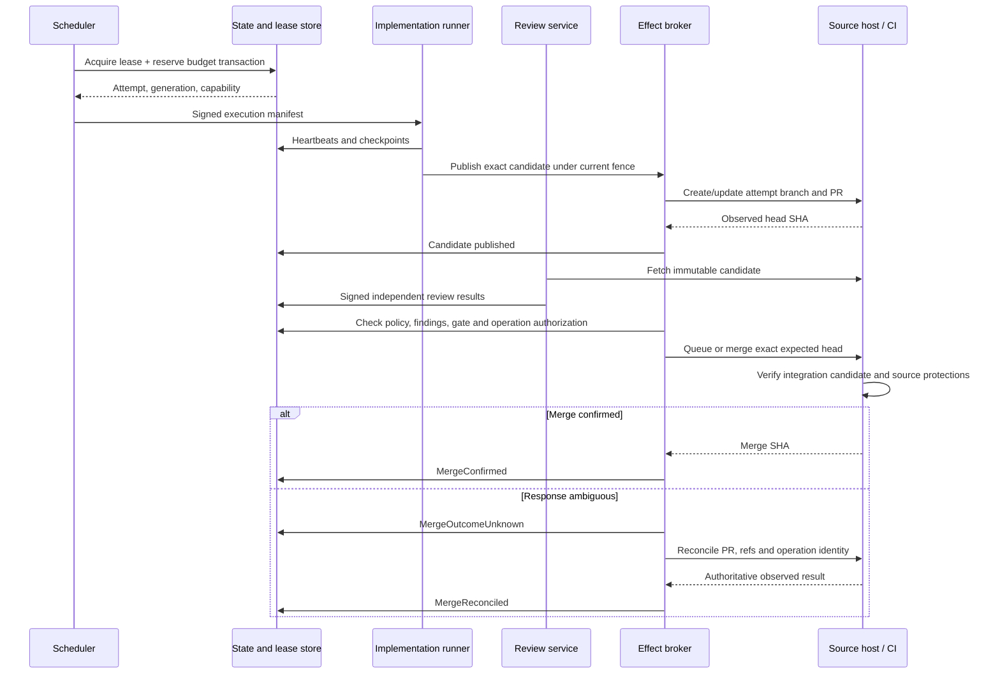

# Nightshift — Reliability, security, economics, and platform choices

[Overview](index.html) · [Document index](README.md) · [Previous](06-milestones-and-product-experience.md) · [Next](08-roadmap-and-decisions.md)
> Design proposal · Packaged 2026-09-09 · Original sections 15–18 preserved below. Repository findings refer to the inspected checkpoint, not live project state.

## 15. Reliability, integration, and disaster recovery

### Source integration protocol

For GitHub, prefer native merge queues where the repository’s plan and ownership support them. Required CI must handle `merge_group`, and Nightshift must verify the actual integration candidate. GitHub documents that merge queues test changes against the latest target branch and queued predecessors; availability is not universal. [GitHub merge queue documentation](https://docs.github.com/en/repositories/configuring-branches-and-merges-in-your-repository/configuring-pull-request-merges/managing-a-merge-queue)

For repositories without queues:

- Serialize factory merges per target branch.
- Require source-host up-to-date protections and qualified checks.
- Submit the exact expected head SHA.
- Revalidate after base changes.
- Exclude uncontrolled bypass actors from the claimed assurance boundary.

GitHub’s merge API accepts a head `sha` and rejects a mismatch. It does not supply a transaction with Nightshift’s database or a general expected-base parameter. [GitHub merge API](https://docs.github.com/en/rest/pulls/pulls#merge-a-pull-request)

High-assurance repositories that require exact reviewed base identity must use an integration mode that enforces it, such as a qualified serialized integration branch or queue policy. They cannot receive that assurance from a head-only API call.



A gate closes in two stages: **admission closed**, then **drained** after earlier admitted effects settle. This establishes an honest operation boundary. A database update cannot instantaneously cancel a source-host merge already executing.

Emergency stop immediately blocks new admissions and revokes credentials where possible. Any already-admitted operations are shown explicitly until reconciled. Native queued operations must be removed or settled before declaring the gate drained.

### Failure behavior

| Failure | Required behavior |
|---|---|
| Orchestrator restart | Replay orchestration; consult committed domain state; retry commands with original keys |
| Runner death | Expire lease, fence, reconcile effects, restart from verified checkpoint in a new attempt |
| Model timeout | Preserve request identity and partial evidence; bounded retry; charge possible duplicate usage |
| Provider outage | Circuit breaker; route only to approved alternatives; preserve assurance class |
| Lost webhook | Periodic reconciliation from source-host/CI APIs |
| Duplicate webhook | Durable inbox deduplication |
| Reordered webhook | Treat as a signal to fetch current state; never apply arrival order as authority |
| Git host rate limit | Respect backoff/reset hints; share tenant installation budget; prioritize safety reconciliation |
| CI hangs | Job deadline; cancel if possible; mark inconclusive/failed and block promotion |
| Base moves during review | Preserve head review as historical evidence; rerun integration validation and risk-required base-sensitive review |
| Partial merge failure | Enter uncertain until remote state proves merged or absent |
| Partial deployment | Record per-component state; maintain compatibility; rollback or forward-fix by policy |
| Duplicate human approval | Same idempotent result; no duplicate grants or release |
| Approval of obsolete bundle | Reject as stale; retain attempted decision in audit |
| Region outage | Fence old regional authority before promoting standby; reconcile external operations |
| Database restore | New authority epoch; revoke old grants; reconcile external reality before scheduling |
| Customer revokes access | Stop admission and credential refresh; preserve evidence; mark unresolved external state explicitly |

### Delivery guarantees

| Operation | Guarantee |
|---|---|
| Domain command/state transition | Effectively once per idempotency key and expected version |
| Event/outbox delivery | At least once |
| Webhook processing | At least once with deduplicated state effects; receipt itself is not guaranteed |
| Runner launch | At least once dispatch; effectively one authoritative attempt through launch IDs and leases |
| Model inference | May execute more than once; one selected result, all observed costs recorded |
| Artifact upload | At least once; content-addressed storage makes identical writes effectively once |
| Review acceptance | Effectively once per assignment/submission; immutable supersession |
| PR/issue creation | Effectively once when stable markers and reconciliation identify an existing object; ambiguity blocks blind retries |
| Merge | Effectively once per immutable integration intent, relying on source-host preconditions and reconciliation |
| Deployment | Effectively once only where the adapter supports identity/preconditions; otherwise uncertain outcomes require investigation |
| Human decision | Effectively once transaction; duplicate authentication responses cannot produce new authority |
| Notifications | At least once; duplicates may occur |
| Billing | Effectively once ledger entries; later corrections are new entries |
| Cancellation | Effectively once admission revocation; external cancellation is best effort |
| Unsupported non-idempotent tool action | At-most-once dispatch, followed by reconciliation; possible omission is preferable to unsafe repetition |

No cross-system “exactly once” claim is made.

### Disaster recovery

Use one write region per tenant. PostgreSQL has synchronous availability-zone redundancy and point-in-time recovery; evidence archives replicate only within customer-approved regions.

Proposed initial targets, to validate before contractual commitment:

- Control API availability: 99.9% monthly.
- Safety admission service availability: 99.95%; outage fails closed.
- Within-region committed-state RPO: zero under the configured synchronous failure model.
- Regional disaster RPO: at most five minutes.
- Regional RTO: four hours.
- Normal projection freshness: under 60 seconds; degraded status clearly displayed.

After restore, an independently controlled authority registry issues a new epoch. Old gateways lose authority; old credentials are revoked or allowed to expire under containment. Never restore the epoch counter solely from the restored database and assume stale workers are fenced.

Recovery rebuilds external operation records from source-host, deployment, artifact, and independently archived audit evidence. Unknown outcomes remain blocked. Run scheduled restore drills, not just backup-success checks.

## 16. Security and multi-tenancy

Use ephemeral VMs for untrusted code. Containers inside them provide packaging and additional restrictions; a shared container host is not the initial customer isolation guarantee.

The first hosted runner can be a full ephemeral VM per attempt. Firecracker is a later density optimization once the runner contract and isolation tests are stable; it provides a microVM building block, not a complete tenant security product. [Firecracker project](https://firecracker-microvm.github.io/)

Required controls:

- Read-only base image, isolated writable workspace, no host mounts or Docker socket.
- No inherited developer SSH agent, cloud credentials, or ambient metadata access.
- Deny-by-default egress through a destination-aware proxy.
- Separate package-fetch phase and approved package cache.
- No shared writable cache across tenants or trust classes.
- Secrets issued only for an identified operation and destination.
- Tenant-specific encryption keys and tenant-bound object access.
- Database tenant isolation enforced in the data access layer and database policy; administrative paths separately audited.
- Region-bound code, prompts, artifacts, backups, and model routing.
- Customer-managed keys and runners with an explicit assurance class.
- Short retention for raw diagnostics; longer retention for accepted evidence by contract.
- No customer-code training or cross-tenant learning without explicit consent.
- Sandboxed presentation/demo origins with no control-plane credentials.
- Signed runtime images, pinned dependencies/actions, SBOMs, and vulnerability response.
- Separate append-only audit export with tightly restricted access.
- Tenant-, program-, repository-, provider-, and global-level kill switches.
- Break-glass permissions with named authority, reason, scope, expiration, and mandatory post-incident review.

Untrusted tests are arbitrary code execution. A test’s passing result does not justify running it in a privileged environment. GitHub’s security guidance specifically warns about privileged workflow triggers checking out untrusted code and about shared caches and credentials. [GitHub Actions secure-use guidance](https://docs.github.com/en/actions/reference/security/secure-use)

Evidence immutability and deletion requirements must be reconciled before retention locks are applied. Default to retention classes and minimal sensitive content; use WORM retention for contracted evidence categories. S3 Object Lock offers retention and legal-hold mechanisms, but configuration and authority determine their protection. [S3 Object Lock](https://docs.aws.amazon.com/AmazonS3/latest/userguide/object-lock.html)

Cryptographic erasure does not remove exported copies or all identifying metadata. The product must report the actual deletion boundary.

## 17. Observability, evaluation, economics, and commercial model

### Telemetry

Use correlated traces across programs, slices, attempts, sessions, model calls, tools, reviews, CI, integration, deployments, milestones, and decisions.

Stable identifiers belong on traces and structured events; avoid placing high-cardinality IDs on every metric label. Long-running programs use linked traces rather than one indefinitely open span.

Use applicable OpenTelemetry conventions for HTTP, RPC, messaging, and model usage, with a versioned `factory.*` namespace for domain events. Pin the adopted GenAI convention version: its documentation has moved to a separate project, and sensitive message/tool fields require explicit handling. [OpenTelemetry GenAI conventions](https://opentelemetry.io/docs/specs/semconv/gen-ai/), [GenAI attributes](https://opentelemetry.io/docs/specs/semconv/registry/attributes/gen-ai/)

Raw prompts, code, tool arguments, and outputs are excluded from normal telemetry by default. Store permitted diagnostic content separately, encrypted, access-controlled, and under short retention. Telemetry is not the evidence archive.

### Metrics

| Metric | Definition |
|---|---|
| Lead time | Contract readiness → merged/accepted/deployed, reported separately |
| Autonomous completion rate | Eligible slices completed without unplanned human intervention |
| Rework rate | Additional implementation effort after independent findings or failed integration |
| Review escape rate | Confirmed post-merge defects attributable to reviewed scope |
| Defect/rollback rate | Defective accepted changes and rollback events per release/outcome |
| Cost per accepted outcome | All program execution, review, CI, infrastructure, and rework cost divided by accepted outcomes |
| Review precision proxy | Adjudicated actionable findings / adjudicated findings |
| Review recall proxy | Seeded defects detected plus independently sampled escapes |
| Human interruption rate | Unplanned human requests per completed slice; scheduled milestones reported separately |
| Evidence freshness | Age and validity of required evidence at admission |
| Policy compliance | Allowed/denied/exception transitions and detected bypasses |
| Resource efficiency | Queue latency, utilization, startup overhead, wasted attempts |
| Model effectiveness | Accepted outcome cost and quality, stratified by task/risk and context |

True review recall is unknowable from accepted findings alone. Use mutation/seeded-defect suites, retrospective defect analysis, and blinded sampling. Report confidence intervals and task mix; do not compare models solely on raw pass rate.

Retrospective learning proposes better decomposition, estimates, routes, and review rules. Changes first run offline, then in shadow mode, then under an authorized configuration version. Learning never silently weakens customer policy.

### Cost accounting

Reserve budgets before launch. Track requested, reserved, estimated incurred, provider-reported, reconciled, and refunded amounts. Version price catalogs by effective date and distinguish cached input, output, reasoning/tool usage where available, compute, CI, storage, and egress.

Hard caps require bounding concurrent outstanding work. A cancellation cannot undo an inference already billed. The maximum permitted exposure is the sum of outstanding bounded requests and runner allowances; display this separately from confirmed spend.

Illustrative planning math, not a provider quote:

```text
Implementation:       $8
Review:               $4
Verification/compute: $3
First-attempt total: $15

At 70% success per comparable attempt:
rough expected cost ≈ $15 / 0.70 = $21.43
```

That estimate excludes correlated failures and milestone-level integration costs; actual accepted-outcome accounting is the commercial truth.

### Commercial productization

- **Pricing:** platform subscription based on active autonomous capacity, plus transparent model/runner usage. Avoid charging per PR or finding.
- **Model billing:** bring-your-own-provider accounts first; optional bundled usage with explicit rates and approved routing.
- **Onboarding:** identity, source App, repository qualification, baseline CI/evidence assessment, policy selection, shadow run, first delegated milestone.
- **Qualification:** repository can build/test reproducibly enough, secrets are isolated, protected integration is enforceable, and acceptance can be demonstrated.
- **Enterprise:** SSO, SCIM, delegated authorities, audit export, regional controls, private runners, customer keys, support boundaries.
- **Ownership:** customer owns source, outputs, and tenant evidence subject to contracted retention; Nightshift owns the platform and generic methods.
- **Responsibility:** Nightshift handles control-plane and managed-runner incidents; customers own business decisions and customer-managed infrastructure, with shared runbooks for adapter failures.
- **SLA:** promise service availability and response commitments; do not guarantee arbitrary software correctness or delivery dates.
- **Moat:** accumulated failure/recovery knowledge, qualified adapters, review evaluation, verified outcome data, evidence interoperability, and customer workflow integration.

The moat is the ability to complete and defend delegated outcomes under failure, not access to a particular coding model.

## 18. Build-versus-buy decisions

| Area | Recommended default | Strongest alternative | Why it loses initially |
|---|---|---|---|
| Durable orchestration | Managed Temporal | Custom PostgreSQL worker/timer engine | Faster local start, but recovery, long waits, retries, and workflow evolution become core maintenance burdens |
| Cloud-native orchestration | Temporal | AWS Step Functions | Strong managed alternative; cloud-specific execution model and portability costs are less suitable for hybrid/customer-hosted plans |
| Domain authority | PostgreSQL with event journal/outbox | Workflow history or tracker as sole database | Poor fit for relational authorization, budgets, joins, and transactional lease updates |
| Policy | Typed schema compiled to OPA | Bespoke evaluator or Cedar | Bespoke rules become hard to explain/test; Cedar is a credible authorization alternative, but OPA better fits the proposed mix of workflow and configuration policy |
| Source host | GitHub first | GitLab first or simultaneous support | Prototype and customer wedge favor GitHub; simultaneous parity delays qualification |
| Integration | Native queue where supported; qualified serialized fallback | Build a universal merge queue | Reimplements source-host semantics and expands risk before demand |
| Execution | Ephemeral full VMs | Shared Kubernetes jobs | More efficient orchestration, but namespaces do not supply the chosen hostile-code boundary |
| Runner density | Later Firecracker | VM per attempt forever | Full VMs win initially on operational simplicity; microVMs become worthwhile when measured cost warrants them |
| Evidence | Object storage + PostgreSQL index | Graph database | Graph relationships are initially tractable relationally; a second database adds operational burden |
| Attestation | in-toto/SLSA-compatible formats | Proprietary evidence format only | Interoperability and external verification matter from the start |
| Identity | Managed customer federation + workload identity | Build an identity provider | Commodity authentication is not the differentiation |
| Model connectivity | Direct approved adapters behind gateway | Universal provider aggregator | Aggregators may obscure version, privacy, usage, and routing guarantees |
| UI | Purpose-built cockpit and milestone room | Tracker-only interface | Trackers cannot clearly represent evidence validity, runtime authority, or contractual acceptance |
| Analytics | PostgreSQL initially; analytical store when justified | Make Cubism a mandatory platform dependency | Dogfooding analytics is useful, but orchestration correctness must not depend on a second evolving product |
| Cloud | AWS reference deployment | Multi-cloud from launch | One operational baseline accelerates qualification; preserve adapter boundaries rather than simultaneous deployments |

Kubernetes may become appropriate for customer installations or a large runner fleet. It is not an architectural prerequisite.

---

[Overview](index.html) · [Document index](README.md) · [Previous](06-milestones-and-product-experience.md) · [Next](08-roadmap-and-decisions.md)
