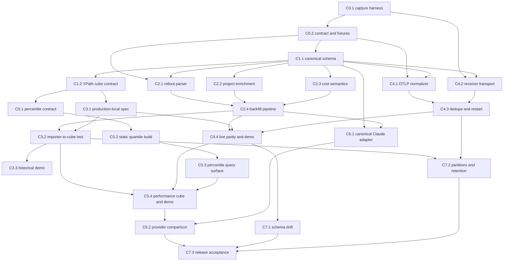

# Codex Telemetry Cube Roadmap

Date: 2026-08-21

Status: proposed; no implementation milestone has started

This document decomposes the Codex telemetry integration into bounded sessions.
Each session should fit in one Codex or Claude Code context window and should
land one primary verification artifact plus the minimum supporting code. It is
a session-sequencing roadmap, not a replacement for Cubism's cube semantics or
the upstream Codex telemetry contract.

The first useful product is a local historical cube. Live OTLP ingestion,
tail-latency support, provider comparison, and operational hardening build on
that result without blocking it.

## Outcome

Codex telemetry becomes an atomic event table that Cubism can aggregate over
every retained dimension combination. Tool calls are represented by hierarchy,
not conditional count measures:

```text
/event/event_kind=tool_call
/event/event_kind=tool_call/tool_name=grep
/event/event_kind=tool_call/tool_name=exec_command
```

With other dimensions, Cubism materializes cells such as:

```text
/event/event_kind=tool_call/tool_name=grep,/project/project=cubism
/event/event_kind=tool_call/tool_name=grep,/outcome/outcome=error
/event/event_kind=response,/model/model_family=gpt-5.6/model=gpt-5.6-sol
```

`events: count` means the number of atomic facts in each cell. Therefore the
cell at `/event/event_kind=tool_call` is the tool-call count, and the deeper
`tool_name` cell is the count for that tool. No `is_tool_call` measure is
needed.

The final local workflow should be:

```text
historical rollout JSONL + state SQLite ----\
                                             > metadata-only normalizer
live Codex OTLP logs and traces ------------/             |
                                                           v
                                                partitioned Parquet events
                                                           |
                                                           v
                                                   Cubism cube build
                                                           |
                                                           v
                                      Python demo / CLI / read-only serving
```

## Grounded starting point

- Cubism already has a metadata-only Claude Code importer and an agent cube.
  The importer explicitly names Codex logs and OpenTelemetry spans as the
  natural follow-on.
- Cubism hierarchies already truncate at the first null level. A response row
  with `event_kind=response, tool_name=NULL` therefore contributes the
  `/event/event_kind=response` prefix, while a tool row contributes both the
  tool-call prefix and its `tool_name` child.
- Codex's documented opt-in OTel logs include conversation starts, API
  requests, response-completion token counts, tool decisions, and tool
  results. The documented metrics include turn duration, TTFT, TTFM, token
  usage, tool duration, approvals, and MCP activity. See the official
  [Codex observability documentation](https://learn.chatgpt.com/docs/config-file/config-advanced#observability-and-telemetry)
  and [configuration reference](https://learn.chatgpt.com/docs/config-file/config-reference).
- Logs and traces are the primary analytical source. OTel metrics are already
  aggregated and their documented default labels do not provide the raw
  conversation/project facts required for YPath drill-down, KMV session sets,
  or top-session sketches.
- The static engine currently rejects `quantile`, although a mergeable
  `QuantileState` and temporal UDAF exist. The current presenter is fixed at
  `p=0.5`. Stage 5 closes that gap for latency analysis.
- The currently served temporal path is narrower than the static cube path.
  This roadmap therefore lands a static local cube first. Continuous temporal
  publication is a follow-on, not a prerequisite for proving Codex analytics.

## Scope boundaries

In scope:

- historical local import from Codex rollout JSONL;
- project enrichment from local Codex state when available;
- live OTLP/HTTP log and trace ingestion;
- one atomic event grain with Cubism-native hierarchical drill-down;
- tokens, estimated nominal cost, tool outcomes, request latency, turn latency,
  TTFT, TTFM, approvals, and session-set analysis;
- strict metadata-only output and deterministic deduplication;
- static cube construction first, with a path to daily partitions.

Not in scope:

- storing prompts, responses, tool arguments, tool output snippets, HTTP
  headers, or authorization material;
- depending on `logs_*.sqlite` as a supported interface;
- claiming that estimated API-list-price cost is an invoice or subscription
  charge;
- reconstructing per-tool token cost by evenly allocating response tokens;
- treating aggregate OTel metrics as the primary cube fact source;
- hosted multi-tenant collection, authentication, or arbitrary remote agents;
- finishing Cubism's full temporal/Iceberg roadmap as part of this feature.

## Proposed artifact layout

Names may change during Stage 1, but keeping the adapter together prevents
Codex-specific parsing from leaking into `cubism-core`:

```text
examples/codex_telemetry/
  README.md
  schema.py
  import_rollouts.py
  normalize_otel.py
  receiver.py
  codex_events.yaml
  demo_local.py
  demo_live.py
  fixtures/
    otlp_logs.json
    otlp_traces.json
    rollout.jsonl
    state.sqlite
    expected_events.json
  tests/
    test_contract.py
    test_schema_cube.py
    test_rollout_import.py
    test_otel_ingest.py
    test_end_to_end.py

docs/codex-telemetry-handoffs/
  C0.1.md
  ...
```

The sanitized `state.sqlite` fixture should be created mechanically inside a
test rather than committed as an opaque binary if that keeps the fixture easier
to audit.

## Canonical event contract to validate in Stage 1

One row represents one logical telemetry event, not one session and not one
assistant message with its tool calls expanded beneath it.

Identity and correlation fields:

```text
event_id                 stable deduplication key; never a cube dimension
event_time               UTC timestamp
provider                 codex initially; claude in Stage 6
session_id               Codex conversation/thread identifier
turn_id                  nullable until the capture spike proves a source key
request_id               nullable
trace_id / span_id       nullable
source_kind              rollout or otlp
source_version           Codex CLI/schema version when available
```

Dimension fields:

```text
event_kind               conversation, turn, response, tool_call,
                         api_request, approval, compaction, other
tool_name                non-null for tool-call descendants; may also be set
                         for another event kind only when Stage 0 proves that
                         the native event identifies the same tool semantic
project                  local project label
repo                     configured stable repository identity when available
model_family / model
reasoning_effort
outcome / error_class
agent_role               main, subagent, reviewer, or unknown
auth_mode / session_source / cli_version
week / day / hour
```

Sparse measure inputs use null outside their applicable event kind:

```text
tokens_input / tokens_cached_input
tokens_output / tokens_reasoning / tokens_total
estimated_cost_usd
tool_duration_ms
api_duration_ms
turn_duration_ms
ttft_ms / ttfm_ms
prompt_length             optional numeric metadata only
```

Using separate sparse duration columns keeps `/G` and `/project/...` useful:
`avg_tool_duration` ignores non-tool rows, while `avg_turn_duration` ignores
non-turn rows. A single generic duration column would produce a meaningless
average across unrelated event kinds.

The first cube spec should include these dimensions:

```yaml
dimensions:
  - name: event
    levels: [event_kind, tool_name]
  - name: project
  - name: repo
  - name: model
    levels: [model_family, model]
  - name: reasoning
    levels: [reasoning_effort]
  - name: outcome
    levels: [outcome, error_class]
  - name: agent
    levels: [agent_role]
  - name: time
    levels: [week, day, hour]
```

High-cardinality correlation IDs stay out of dimensions. They are inputs to
`count_distinct`, `top_k`, or `reservoir_sample` measures.

## Session sizing and model policy

Every session follows the same contract:

1. Read this roadmap, the handoffs of direct dependencies, and only the target
   files needed for the slice.
2. Confirm the named integration test can fail before the implementation is
   accepted.
3. Land one primary test plus supporting code; avoid adjacent refactors.
4. Run the slice's focused tests and any crate-wide tests affected by the
   change.
5. Write a short handoff containing: built, verified, does not prove, deferred,
   and current worktree state.
6. Mark the session and milestone status here only after the verification is
   fresh and passing.

Model classes used below:

| Class | Codex recommendation | Claude Code equivalent | Use |
|---|---|---|---|
| R | `gpt-5.6-sol`, `high`; use `xhigh` only where marked | current Opus-class reasoning model | schema decisions, engine/API semantics, failure recovery |
| B | `gpt-5.6-terra`, `high` | current Sonnet-class balanced model | bounded implementation and integration tests |
| F | `gpt-5.6-luna`, `medium` | current fast/Haiku-class model | mechanical fixtures, demos, documentation |

The model mapping is intentionally a current recommendation, not a permanent
requirement. Official OpenAI guidance describes `sol` as the flagship tier,
`terra` as the intelligence/cost balance, and `luna` as the efficient
high-volume tier; it also recommends measuring whether higher reasoning effort
improves the actual workload. See [current model guidance](https://developers.openai.com/api/docs/guides/latest-model).

## Stage 0 — Capture and freeze the upstream Codex contract

### Milestone M0 — A sanitized, replayable Codex OTel contract exists

**Status:** Not started.

The official documentation is the supported starting point, but representative
event lists are not enough to implement correlation and deduplication. Capture
one controlled run before freezing the canonical schema.

| Session | Scope and deliverable | Model | Depends on |
|---|---|---|---|
| C0.1 | Build a loopback-only OTLP/HTTP JSON capture harness. Run one controlled Codex session containing a successful tool, a failed tool, and a normal response. Capture logs and traces with `log_user_prompt=false`. Do not normalize yet. | B | none |
| C0.2 | Inventory resource attributes, event names, timestamps, correlation keys, token fields, duration units, batching, and shutdown behavior. Sanitize captured payloads into golden fixtures and record the mapping uncertainties. | R | C0.1 |

**Required verification:** `test_contract.py` starts the capture endpoint on an
ephemeral loopback port, replays the sanitized OTLP envelopes, and asserts:

- the receiver accepts the same content type and OTLP shape Codex emitted;
- every required event type in the controlled run is present;
- conversation ID and model are recoverable;
- response-completion token counts and tool duration/outcome are recoverable;
- trace/log correlation fields are either demonstrated or explicitly recorded
  as absent;
- canary secrets placed in prompt, tool argument, tool output, and header fields
  do not appear in the sanitized fixture.

CI replays the fixture; it does not launch an authenticated Codex process. A
fresh live capture is the additional release gate whenever a new Codex version
changes the contract.

**Demo:** `inspect_contract.py` prints a compact event inventory such as event
name, count, safe attribute names, and correlation coverage. It must print no
prompt or tool content.

**Done when:** the golden fixtures, inventory, privacy assertion, live-capture
transcript, and a `does not prove` note are committed and passing.

## Stage 1 — Define the atomic event schema and prove its cube semantics

### Milestone M1 — Synthetic canonical events produce the intended YPaths

**Status:** Not started.

| Session | Scope and deliverable | Model | Depends on |
|---|---|---|---|
| C1.1 | Freeze the Arrow/Parquet schema, event-kind vocabulary, nullability, event-ID rules, and privacy whitelist in `schema.py`. Include schema-version metadata. | R (`xhigh`) | C0.2 |
| C1.2 | Add a small synthetic canonical dataset, the first `codex_events.yaml`, and an end-to-end Cubism lattice test. This session owns YPath spelling and filter rules, not source parsing. | B | C1.1 |

**Required integration test:** `test_schema_cube.py` builds a real cube from a
fixture containing two sessions, at least three tool calls, a response, an API
request, and an approval. It asserts exact cells including:

```text
/G
/event/event_kind=tool_call
/event/event_kind=tool_call/tool_name=grep
/event/event_kind=response
/event/event_kind=tool_call/tool_name=grep,/project/project=cubism
/event/event_kind=tool_call,/outcome/outcome=error
```

The expected assertions must prove:

- `/G.events` equals all atomic rows;
- the tool-call prefix equals only tool-call rows;
- the `grep` child equals only grep calls;
- non-tool rows truncate at `event_kind` because `tool_name` is null;
- response token sums appear at `/event/event_kind=response` and project/model
  combinations without being duplicated onto tool rows;
- session KMV estimates are exact for the under-full fixture;
- a project/tool/error XUnit is canonical regardless of dimension declaration
  order.

**Demo:** print the fixture's event hierarchy as an indented tree with counts
and then show one project-by-tool XUnit. This is the smallest communication
artifact that proves the Cubism model before real user data is involved.

**Done when:** the schema, cube spec, exact expected cells, and integration test
are committed and passing. No source-specific parser is part of this milestone.

## Stage 2 — Historical local backfill

### Milestone M2 — Local Codex history imports deterministically and privately

**Status:** Not started.

This stage uses rollout JSONL for structured historical facts and local state
SQLite only for enrichment. It does not use `logs_*.sqlite`.

| Session | Scope and deliverable | Model | Depends on |
|---|---|---|---|
| C2.1 | Implement a version-tolerant rollout JSONL parser over sanitized fixtures. Emit response, tool-call/result, turn-context, compaction, and other proven event kinds. Use per-turn/last token deltas rather than summing cumulative session totals. | B | C0.2, C1.1 |
| C2.2 | Implement conversation-to-project enrichment through an explicitly supplied state DB/path map. Test missing rows, nested working directories, and renamed/missing repositories. Never require the test runner's real `~/.codex`. | B | C1.1 |
| C2.3 | Add versioned nominal-cost estimation from response token rows. Store `estimated_cost_usd` and `cost_basis`; never call it billed cost. Test cached-input and reasoning-token policy explicitly. | F | C1.1 |
| C2.4 | Compose discovery, parsing, enrichment, deduplication, deterministic ordering, and Parquet output into `import_rollouts.py`. Add bounded `--since`, `--session`, and `--codex-dir` inputs. | B | C2.1, C2.2, C2.3 |

**Required integration test:** `test_rollout_import.py` points the importer at a
temporary fixture directory and a temporary synthetic state database, runs the
same import twice, and asserts:

- both runs produce the same ordered `event_id` set and equivalent Parquet;
- exactly one canonical row is emitted per logical source event;
- token sums equal the fixture's final per-turn usage without cumulative
  double-counting;
- tool names, outcomes, models, reasoning effort, timestamps, and projects are
  correct;
- missing enrichment produces `project=NULL` or the documented fallback rather
  than dropping the event;
- prompt/response/tool-content canaries are absent from column names, values,
  Parquet metadata, and a raw byte scan of the output;
- no test reads the operator's actual Codex home.

**Demo:** a local-only command imports the last seven days of real sessions and
prints session count, project count, event-kind counts, token totals, and the
output path. It does not build a cube yet and prints no content fields.

**Done when:** fixtures pass, repeated imports are idempotent, token totals are
reconciled, privacy checks pass, and a real local import succeeds.

## Stage 3 — First useful static Codex cube

### Milestone M3 — Historical Codex sessions are queryable as a Cubism cube

**Status:** Not started.

| Session | Scope and deliverable | Model | Depends on |
|---|---|---|---|
| C3.1 | Finalize the production-local cube spec: dimensions, hierarchies, `max_dimensions`, exclusions, event count, token sums, average/min/max sparse latency measures, session KMV, top sessions, and exemplars. | B | C1.2 |
| C3.2 | Add a black-box importer-to-cube integration test using the CLI or Python binding. Compare selected cube cells with exact expected values computed directly from canonical rows. | R | C2.4, C3.1 |
| C3.3 | Build `demo_local.py` and its README walkthrough over a user's own sessions. Keep the demo deterministic after the input Parquet is produced. | F | C3.2 |

**Required integration test:** `test_end_to_end.py` executes this complete path
inside a temporary directory:

```text
rollout fixture + synthetic state DB
  -> import_rollouts.py
  -> canonical Parquet
  -> Cubism build using codex_events.yaml
  -> cube Parquet / query API
```

It asserts exact values for:

- total events and sessions;
- response tokens by project and model;
- tool calls and failures by tool YPath;
- sessions using `grep` intersected with sessions having an error, using KMV
  set operations;
- top sessions by estimated cost;
- cache-input share from response rows;
- absence of unrequested high-cardinality ID dimensions.

The reference answers must come from the fixture rows, not from another Cubism
query over the same cube.

**Demo:** the local walkthrough answers five visible questions:

1. Which projects and models consume the most tokens?
2. Which tools are called most often?
3. Which tools fail most often, using tool/outcome XUnits?
4. Which sessions combine a selected tool with errors?
5. How much input volume is served from cache, and what is the explicitly
   labeled nominal API-cost estimate?

**Done when:** a clean-checkout command builds and queries the historical cube,
the black-box integration test passes, and the demo output includes real XUnits
rather than only importer summaries. This is the historical MVP release gate.

## Stage 4 — Live OTLP ingestion

### Milestone M4 — A completed Codex session appears once in a live-fed cube

**Status:** Not started.

The receiver belongs beside the adapter, not in `cubism-core`. Production use
may place an OpenTelemetry Collector in front of it for queues and retries, but
the Cubism-owned normalization contract stays the same.

| Session | Scope and deliverable | Model | Depends on |
|---|---|---|---|
| C4.1 | Implement pure OTLP log/trace envelope-to-canonical-row normalization from the Stage 0 fixtures. Unknown attributes are ignored; unknown event kinds are retained safely as `other` with no body. | B | C0.2, C1.1 |
| C4.2 | Implement a loopback OTLP/HTTP receiver with bounded request size, explicit content types, graceful shutdown, and canonical append output. Keep transport separate from normalization. | R | C0.1, C1.1 |
| C4.3 | Add durable event-ID deduplication, atomic partition writes, restart recovery, duplicate-delivery behavior, and malformed-request behavior. | R | C4.1, C4.2 |
| C4.4 | Add a live configuration example, paired OTel/rollout reconciliation test, and `demo_live.py`. The demo runs Codex through a separate telemetry profile rather than mutating unrelated user configuration. | B | C2.4, C3.1, C4.3 |

**Required integration test:** `test_otel_ingest.py` starts the real receiver on
an ephemeral port, POSTs the golden envelopes twice, shuts it down, restarts it,
POSTs them again, builds a cube, and asserts:

- every logical event appears exactly once after duplicate delivery and
  restart;
- malformed or oversized input returns a defined error without corrupting the
  committed partition;
- only canonical whitelist columns are persisted;
- token totals, model, tool name, outcome, and duration match the paired
  rollout fixture for the same controlled session where both sources expose
  the fact;
- source-specific events that cannot be reconciled are documented rather than
  silently forced into false parity;
- the resulting cube satisfies the same core cells as Stage 3.

**Demo:** start the receiver, run one small Codex session with prompt logging
disabled, stop or flush the receiver, rebuild the local cube, and show the new
session under its project/model/tool YPaths. The transcript must include the
effective telemetry configuration and prove that no prompt/tool content is in
the persisted Parquet.

**Done when:** deterministic replay, duplicate/restart tests, paired-source
reconciliation, and one live local run pass. This is the live-local release
gate; it does not claim durable remote delivery through collector outages.

## Stage 5 — Tail-latency and performance analytics

### Milestone M5 — Cubism answers p50/p95/p99 latency by any retained XUnit

**Status:** Not started.

This stage can begin after Stage 1 and run in parallel with the historical and
live adapters. It should not wait for Stage 4 to start.

| Session | Scope and deliverable | Model | Depends on |
|---|---|---|---|
| C5.1 | Freeze the percentile presentation contract: one mergeable quantile state per latency measure, queried at arbitrary probability. Specify null, empty, invalid-probability, and fixed-bin error semantics. | R (`xhigh`) | C1.2 |
| C5.2 | Wire the existing quantile state/UDAF into static cube construction and preserve the encoded state in output. Add direct-versus-partitioned merge tests. | R (`xhigh`) | C5.1 |
| C5.3 | Expose arbitrary percentile presentation through the chosen Python and/or serving boundary. Do not materialize separate duplicate sketches for p50, p95, and p99. | R | C5.2 |
| C5.4 | Add quantile measures to the Codex performance cube, a black-box latency test, and a performance-focused demo section. | B | C3.2, C4.4, C5.3 |

**Required integration test:** a deterministic latency fixture contains known
tool, API, turn, TTFT, and TTFM distributions split into at least two input
partitions. The test builds direct and partitioned/merged states and asserts:

- encoded quantile state survives cube output and reload;
- direct and merged states return the same p50, p95, and p99;
- each answer lies within the documented fixed-bin error bound of the exact
  reference quantile;
- invalid probabilities fail clearly and empty/all-null cells return the
  documented no-value result;
- `/event/event_kind=tool_call/tool_name=grep` returns grep latency only;
- project/model/tool/outcome combinations return the correct distribution;
- sparse tool/API/turn columns do not mix unrelated duration populations.

**Demo:** show, for real local sessions where fields are available:

- slowest tools by p95 and call volume;
- p50 versus p95 turn duration by model and reasoning effort;
- TTFT versus total turn time;
- successful versus failed tool latency;
- API latency/retry outliers;
- token/cache/reasoning mix alongside performance, without claiming causality.

**Done when:** the quantile path is static-build capable, arbitrary percentile
presentation is public and tested, exact-reference bounds pass, and the demo
shows tail latency from real or clearly labeled fixture data.

## Stage 6 — Converge Claude and Codex on one agent-event cube

### Milestone M6 — Provider comparison uses identical event and cube semantics

**Status:** Not started; optional for the Codex-only MVP, recommended before
presenting Cubism as a general agent-observability product.

| Session | Scope and deliverable | Model | Depends on |
|---|---|---|---|
| C6.1 | Add a v2 Claude adapter that emits separate response and tool-call rows in the canonical schema. Preserve the existing Claude demo as a compatibility path until totals are reconciled. | B | C1.1, C2.4 |
| C6.2 | Add `provider` to the shared cube spec and a cross-provider integration test/demo. Explicitly prevent synthetic per-tool token allocation from contaminating provider comparisons. | B | C5.4, C6.1 |

**Required integration test:** paired small Claude and Codex fixtures pass
through their source adapters into one canonical Parquet dataset and cube. The
test asserts:

- `/provider/provider=codex` and `/provider/provider=claude` partition `/G`
  exactly;
- event-kind and tool-name YPaths have identical meaning across providers;
- each provider's response-token totals reconcile with its source fixture;
- tool counts and outcomes reconcile independently of response tokens;
- session KMV unions/intersections work across provider cells;
- estimated cost is labeled by a compatible `cost_basis`, and incompatible or
  unknown billing semantics are never silently summed as authoritative spend.

**Demo:** one report compares provider/model/project/tool activity and latency,
then demonstrates a session-set question. Every panel states whether the data
is measured, estimated, unavailable, or provider-specific.

**Done when:** both adapters satisfy the same schema contract, the old Claude
totals have a written reconciliation, and the provider comparison runs without
special-case query logic.

## Stage 7 — Drift, retention, and reproducible release

### Milestone M7 — The local telemetry product survives restart and schema drift

**Status:** Not started.

| Session | Scope and deliverable | Model | Depends on |
|---|---|---|---|
| C7.1 | Add fixture-version/schema-drift coverage. Unknown safe attributes are ignored, unknown event kinds map to `other`, and missing formerly known attributes yield null rather than dropping sessions. | B | C4.4 |
| C7.2 | Add daily partition rotation, retention, atomic rebuild, and an explicit late-event policy for local files. Keep raw OTLP bodies ephemeral; retain only canonical rows. | R | C3.2, C4.3 |
| C7.3 | Add the clean-checkout acceptance script, focused CI jobs, benchmark report, user setup/troubleshooting, and security documentation. | B | C6.2, C7.1, C7.2 |

**Required integration test:** the acceptance script uses two fixture schema
versions and a multi-day stream. It:

1. ingests days 1 and 2;
2. restarts the receiver;
3. redelivers duplicates;
4. ingests an unknown event and a late event for day 1;
5. applies the documented rewrite policy;
6. builds the cube twice;
7. compares both final cubes with a one-shot exact reference build.

The final cell values, event IDs, KMV estimates for the small fixture, top-k
items, token totals, and quantile values must match. Retention must remove only
the requested canonical partitions and must never inspect or delete unrelated
Codex files.

The benchmark records source rows, cube cells, wall time, peak memory when
available, and output size. It is initially informational; an absolute
performance threshold should be added only after the same benchmark has a
stable CI baseline.

**Demo:** a clean-checkout script documents setup, historical import, live
capture, cube build, representative queries, privacy inspection, and teardown.
It should be possible for a new user to complete without editing source or
providing secrets.

**Done when:** the acceptance script passes from a clean checkout, fixture
versions are supported as documented, retention is safely scoped, focused CI is
green, and the README's commands have been rerun verbatim.

## Session dependency DAG



### Useful parallel execution waves

These are scheduling hints, not additional dependencies:

| Wave | Sessions that may run in parallel after the prior gate |
|---|---|
| 1 | C0.1 |
| 2 | C0.2 |
| 3 | C1.1 |
| 4 | C1.2, C2.1, C2.2, C2.3, C4.1, C4.2 |
| 5 | C2.4, C3.1, C5.1 |
| 6 | C3.2, C4.3, C5.2, C6.1 |
| 7 | C3.3, C4.4, C5.3 |
| 8 | C5.4, C7.1, C7.2 |
| 9 | C6.2 |
| 10 | C7.3 |

The dependency subgraph to the first useful historical cube is:

```text
C0.1 -> C0.2 -> C1.1
                     |-> C1.2 -----------------> C3.1 --\
                     |-> C2.1 --\                         \
                     |-> C2.2 ----> C2.4 -----------------> C3.2 -> C3.3
                     \-> C2.3 --/
```

The quantile engine branch begins at C1.2 and can proceed independently of
both source adapters until C5.4. The OTLP normalizer and receiver transport are
also independent sessions and join only at C4.3.

## Verification batteries

Each session runs its focused test. Milestone-closing sessions additionally
run the applicable battery below; exact commands should be updated when the
test layout lands.

Adapter-only change:

```bash
rtk proxy uv run --with pyarrow python -m unittest discover \
  -s examples/codex_telemetry/tests -v
rtk git diff --check
```

Cube/spec or serving change:

```bash
rtk cargo test -p cubism-datafusion
rtk cargo test -p cubism-serve
rtk proxy uv run --with pyarrow python -m unittest discover \
  -s examples/codex_telemetry/tests -v
rtk git diff --check
```

Core aggregate or encoding change:

```bash
rtk cargo test -p cubism-core
rtk cargo test -p cubism-datafusion
rtk cargo test --workspace
rtk git diff --check
```

Do not report a carried-forward test count. Milestone handoffs record the
fresh command, result, and what the test does not prove.

## Release checkpoints

| Checkpoint | Milestone | Capability |
|---|---|---|
| Contract | M0 | Upstream event shapes and privacy boundary are evidenced |
| Model | M1 | Atomic facts produce correct Cubism YPaths and measures |
| Backfill | M2 | Existing Codex history becomes deterministic Parquet |
| Historical MVP | M3 | Real local history becomes a queryable cube and demo |
| Live local | M4 | New Codex sessions arrive once through OTLP |
| Performance | M5 | Tail latency is queryable by arbitrary cube cell |
| Agent comparison | M6 | Claude and Codex share semantics |
| Reproducible local release | M7 | Drift, restart, retention, CI, and setup are covered |

## Final definition of done

The overall task is done when M5 is complete for a Codex-only performance
product, or M7 is complete for the provider-neutral, reproducible local
release. At the chosen boundary:

- the supported source interfaces are explicit and version-tested;
- all persisted rows satisfy the metadata-only whitelist;
- `/event/event_kind=tool_call/tool_name=<name>` and its combinations return
  exact event counts;
- response tokens reconcile without per-tool synthetic allocation;
- session KMV and top-session sketches work over project/model/tool/outcome
  cells;
- p50/p95/p99 latency is available from mergeable state with documented error;
- repeated historical import and repeated live delivery are idempotent;
- a clean-checkout demo communicates the result with real XUnits;
- every milestone has a passing integration test and a handoff that states
  what it does not prove.

## Explicitly deferred follow-ons

- hosted authenticated OTLP ingestion and tenant isolation;
- an OpenTelemetry Collector deployment chart or managed queue;
- organization-wide project identity governance;
- authoritative invoice reconciliation;
- arbitrary prompt/content analytics;
- full temporal/Iceberg continuous serving and late-window correction;
- cross-machine partial-cube merge orchestration;
- alerting or causal claims about model/tool performance.

Those should receive their own roadmaps once the local canonical event and
cube contracts are proven. They should not be smuggled into the sessions above.
